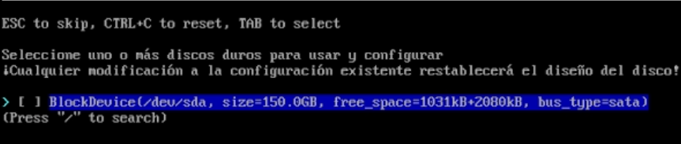
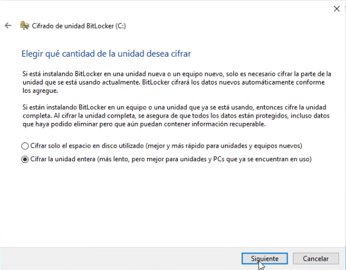

<h1 style="text-align:center;font-size:40px;margin-top: 150px">Securización de un puesto de trabajo Portatil con Windows y Linux</h1>
<div align='center'></div>


<!-- Salto de pagina -->
<div style="page-break-after: always;"></div>

<h2>Índice</h2>

<!-- vscode-markdown-toc -->
* 1. [Introducción](#Introduccin)
* 2. [Instalación](#Instalacin)
	* 2.1. [Objetivo](#Objetivo)
	* 2.2. [Windows](#Windows)
	* 2.3. [Linux](#Linux)
* 3. [Configuración](#Configuracin)
	* 3.1. [BIOS / UEFI](#BIOSUEFI)
	* 3.2. [Windows](#Windows-1)
		* 3.2.1. [TPM 2.0](#TPM2.0)
		* 3.2.2. [Cifrado](#Cifrado)
	* 3.3. [Linux](#Linux-1)
		* 3.3.1. [GRUB](#GRUB)
* 4. [Resultado](#Resultado)
* 5. [Referencias](#Referencias)

<!-- vscode-markdown-toc-config
	numbering=true
	autoSave=true
	/vscode-markdown-toc-config -->
<!-- /vscode-markdown-toc -->

<!-- Salto de pagina -->
<div style="page-break-after: always;"></div>

##  1. <a name='Introduccin'></a>Introducción

El objetivo es lograr que un puesto de trabajo portátil sea seguro, para esto se configurara adecuadamente la BIOS con una contraseña si se quiere acceder a ella y evitando que se pueda entrar con un Live USB, un gestor de arranque GRUB protegido con usuario y contraseña en el que podemos seleccionar entre Windows y Arch linux, ambos encriptados.

##  2. <a name='Instalacin'></a>Instalación

###  2.1. <a name='Objetivo'></a>Objetivo

Buscamos algo similar a esto:
<div align='center'></div>

En este la tabla de particiones es tipo **DOS**

`/dev/sda1` `/dev/sda3` Son las particiones que creara por defecto Windows ademas de `/dev/sda2` que es el disco local `C:`.

En el espacio libre tendremos que crear una partición `/boot/` que sera `/dev/sda4` y `/` que sera `/dev/sda5` para Linux.

<!-- Salto de pagina -->
<div style="page-break-after: always;"></div>

###  2.2. <a name='Windows'></a>Windows

Descargamos una imagen [ISO de Windows](https://www.microsoft.com/es-es/software-download/windows10ISO).

Debemos establecer el tipo de disco en GPT ya que necesitamos más de las que MBR nos permite crear, para esto pulsamos la combinación de teclas `SHIFT+F10` para obtener una terminal en el medio de instalación y aquí hacemos lo siguiente:

```sh
DISKPART 

DISKPART> list disk

DISKPART> select disk X  # El disco que utilicemos 

DISKPART> clean

DISKPART> convert gpt
```

<div align='center' style='height:250px'></div>

Una vez modificado iniciamos con la instalación común de Windows, usado la opción de nuevo podemos crear ya las particiones y dejar el espacio disponible después de la partición de Windows y así no tener que dimensionaría en la instalación de Linux ya que esto podría generar problemas.

<div align='center' style='height:250px'></div>

<!-- Salto de pagina -->
<div style="page-break-after: always;"></div>

###  2.3. <a name='Linux'></a>Linux

Una vez tenemos el Windows instalado descargaremos la [ISO de Arch](https://archlinux.org/download/).

La primera ventana que veremos al iniciar Arch sera esta.

<div align='center'></div>

> Arch es una distribución de Linux muy ligera, por lo tanto la primera vez que la iniciamos no disponemos de ningún entrono gráfico, tenemos una terminal en la cual podemos realizar la instalación.

> Anteriormente la instalación  de este sistema era manual y se requería conocimiento de los comandos y utilidades a utilizar, esta es una pequeña [guía](https://laguialinux.es/instalar-arch-linux-cifrado/).
>
>  En las ultimas versiones se añadió la utilidad `archinstall` la cual facilita con selección de opciones la instalación.

Para crear las particiones necesarias es cómodo hacerlo desde `cfdisk /dev/sdX`:

<div align='center'></div>

<div align='center'></div>

Creamos una de 512MB que sera el `/boot/` de tipo *EFI SYSTEM* y una `/` que será la raíz y ademas ira encriptada.

<!-- Salto de pagina -->
<div style="page-break-after: always;"></div>

Si ejecutamos `archinstall` tendremos este menú de opciones.

<div align='center'></div>

Seleccionamos el idioma.

<div align='center'></div>

Seleccionamos el disco que vamos a utilizar en la opción `device`, en este caso `/dev/sda`.

<div align='center'></div>

<!-- Salto de pagina -->
<div style="page-break-after: always;"></div>

Una vez seleccionado entramos en el menu de **Disco(s)**.

<div align='center'></div>

Lo unicó que esta por defecto es la partición `/boot` como _booteable_.

Con la opción de _Asignar punto de montaje para una partición_ se le asignará a la partición número **4** **/boot** y a la número **5** se le asignará **/** tal que así:

<div align='center'></div>

<!-- Salto de pagina -->
<div style="page-break-after: always;"></div>

Con la opción de _Establecer el sistema de archivos_ se le asignará a la partición número **4** **fat32** y a la número **5** se le asignará **ext4** tal que así:

<div align='center'></div>

Guardamos y salimos.

Una vez definido esto, el siguiente paso es entrar en _disk encryption_, aquí estableceremos la contraseña de cifrado y nos saldrá este menú.

<div align='center'></div>

Dentro de _partitions_ seleccionamos la partición `/`

<div align='center'></div>

<!-- Salto de pagina -->
<div style="page-break-after: always;"></div>

En el gestor de arranque seleccionaremos GRUB.

En el resto de ajustes podemos seleccionar algo similar a esto: desactivaremos el _Swap_, cambiaremos el nombre de host si es necesario y la contraseña de root y añadiremos un usuario.

En perfil seleccionaremos el gestor de ventanas que más nos gusta.

<div align='center' style='height:350px'></div>

En caso de que este todo bien y no tenga ningún error debería empezar a instalar el sistema.

<div align='center' style='height:400px'></div>

Una vez finalizado volvemos a tener la consola, si esta todo bien y ejecutamos `reboot` deberia de reiniciarse y mostrarnos el GRUB.

<!-- F grub -->

<!-- Salto de pagina -->
<div style="page-break-after: always;"></div>

##  3. <a name='Configuracin'></a>Configuración

###  3.1. <a name='BIOSUEFI'></a>BIOS / UEFI

> Esta configuración puede variar entre los fabricantes.
>
> En este caso el portátil es de Lenovo.

En este módelo de portatil Lenovo se accede con el `F2` y tendremos un menú gráfico del fabricante, entraremos en las opciones avanzadas.

<div align='center' style='height:350px'></div>

El primer paso es añadirle una contraseña a el administrador, de este modo nos aseguramos que no se tenga acceso a esta configuración sin contraseña y por lo tanto al selector de dispositivos de arranque al cual, mediante la consola de Grub, se puede acceder sin contraseña.

<div align='center' style='height:350px'></div>

Ahora habilitaremos el _secure boot_ 

> Secure Boot protege el proceso de arranque contra ataques de seguridad de código malicioso como malware y ransomware. Secure Boot depende del firmware y requiere que el BIOS de la computadora esté configurado en modo UEFI.

<div align='center' style='height:400px'></div>

Por ultimo guardamos los cambios con `F10` y tratamos de volver a entrar, ahora debería de solicitar la contraseña del administrador para poder acceder a la configuración.

<div align='center' style='height:400px'></div>

<!-- Salto de pagina -->
<div style="page-break-after: always;"></div>

###  3.2. <a name='Windows-1'></a>Windows

Una vez se complete la instalación hay que cifrar el disco local `C:`, lo cómodo es hacerlo con Bitlocker.

> Existen alternativas como pueden ser **Veracrypt** o **BestCrypt**

####  3.2.1. <a name='TPM2.0'></a>TPM 2.0

> Es necesario tener TPM 2.0.
> 
> El TPM 2.0 es un chip de seguridad integrado en dispositivos que ofrece protección contra amenazas de seguridad, cifrado de datos y generación de claves de seguridad.
> 
> TPM 2.0 se empezó a implementar en 2016 y puede que en equipos no tan nuevos no dispongan de el, pero modificando algunas directivas de grupo se puede evitar.


Abrimos `Editar las directivas del grupo` y nos dirigimos a: `Configuración del equipo > Directivas > Plantillas administrativas > Componentes de Windows > Cifrado de unidad BitLocker > Unidades del sistema operativo`.

<div align='center'></div>

<!-- Salto de pagina -->
<div style="page-break-after: always;"></div>

Entramos en `Requerir autenticación adicional al iniciar` 

<div align='center' style='height:500px'></div>

<!-- Salto de pagina -->
<div style="page-break-after: always;"></div>

####  3.2.2. <a name='Cifrado'></a>Cifrado

Ya modificado hay que seguir estos pasos:

<div align='center'></div>

<!-- Salto de pagina -->
<div style="page-break-after: always;"></div>

Podemos utilizar una unidad USB en lugar de contraseña, pero en este caso utilizare la contaseña.

<div align='center'></div>

<div align='center'></div>

<!-- Salto de pagina -->
<div style="page-break-after: always;"></div>

Debemos guardar una copia de la clave de recuperación por si olvidamos la contraseña o perdemos el USB.

<div align='center'></div>

Ciframos la unidad entera.

<div align='center'></div>

<!-- Salto de pagina -->
<div style="page-break-after: always;"></div>

<div align='center'></div>

Es necesario reiniciar para que se aplique el cifrado.

<div align='center' style='height:340px'></div>

<!-- Salto de pagina -->
<div style="page-break-after: always;"></div>

Nos pedira la contraseña.

<div align='center' style='height:420px'></div>

La unidad ya aparece cifrada.

<div align='center'></div>

Y si entramos en la configuración del bitlocker tambien deberia de indicarlo.

<div align='center' style='height:320px'></div>

<!-- Salto de pagina -->
<div style="page-break-after: always;"></div>

###  3.3. <a name='Linux-1'></a>Linux

####  3.3.1. <a name='GRUB'></a>GRUB

> Porque es esto necesario si ya están ambas particiones cifradas?
> > Aunque hayamos establecido contraseñas de usuario y administrador en la BIOS / UEFI teniendo acceso físico al equipo pueden acceder a un live USB usando la consola de GRUB o modificando alguna entrada.

Crear contraseña:

```sh
❯ sudo grub-mkpasswd-pbkdf2

Introduzca la contraseña:
Reintroduzca la contraseña:
El hash PBKDF2 de su contraseña es grub.pbkdf2.sha512.10000.3970CDA30BF4E9119010F2CB326C35BE9C12FD5B646EC80EF26A10EB15578BB199F1A77ECC5E9C230FC1DEFC3EB8F50C0390F38DA2459C05C06A7E4D0A83DE44.4BA74C780214144CF2736C328DA239E76B9ECFB8421647ECEF26412F6F7D8F97509B23992D158B194D9B4340B75BBD490A625EE81FE79E274E63A4668490BB8C
```

Editar archivo de grub `sudo nvim /etc/grub.d/00_header` modificando *NombreUsuario* por nuestro usuario:

```sh
cat << EOF
set superusers="NombreUsuario"
password_pbkdf2 NombreUsuario grub.pbkdf2.sha512.10000.3970CDA30BF4E9119010F2CB326C35BE9C12FD5B646EC80EF26A10EB15578BB199F1A77ECC5E9C230FC1DEFC3EB8F50C0390F38DA2459C05C06A7E4D0A83DE44.4BA74C780214144CF2736C328DA239E76B9ECFB8421647ECEF26412F6F7D8F97509B23992D158B194D9B4340B75BBD490A625EE81FE79E274E63A4668490BB8C
EOF
```
Dentro de este archivo, `sudo nvim /etc/grub.d/10_linux` los *menuentry* añadiendo `--users NombreUsuario` modificando *NombreUsuario* por nuestro usuario::

```sh
echo "menuentry '$(echo "$title" | grub_quote)' ${CLASS} --users NombreUsuario $menuentry_id_option 'gnulinux-$version-$type-$boot_device_id' {" | sed "s/^/$submenu_indentation/"
echo "menuentry '$(echo "$os" | grub_quote)' ${CLASS} --users NombreUsuario \$menuentry_id_option 'gnulinux-simple-$boot_device_id' {" | sed "s/^/$submenu_indentation/"
```

Este paso lo debemos repetir en el archivo `30_os-prober` que es el archivo que se encarga de detectar otros sistemas, en este caso el windows, y añadirle al *Menuentry* el usuario


Una vez editado todo y comprobado que este bien ejecutamos `sudo update-grub` o `sudo update-grub2` dependiendo de la versión que tengamos, por ejemplo, en Arch, no viene instalado por defecto, lo instalaremos con `sudo pacman -s update-grub`.

> Si queremos añadir más de un usuario en los archivos debemos de separarlos por comas (",").
>
> Es importante comprobar que una vez en el grub, al disponer de opciones como entrar en la configuración de UEFI, opciones avanzadas de Linux o la propia linea de comandos que se puede acceder con `C` podemos hacer un `exit` o modificar la entrada y así utilizar un Live USB.

<!-- Salto de pagina -->
<div style="page-break-after: always;"></div>

##  4. <a name='Resultado'></a>Resultado

Una vez terminado tendremos que obtener un resultado similar a este al iniciar el portátil:

<div align='center'></div>

Nos aseguramos en la consola de GRUB ( `C` ) también solicita el usuario y contraseña como en la opción de Windows y de Linux.

<div align='center'></div>

Sí accedemos en primer lugar a Arch nos e introducimos usuario y contraseña nos debería de pedir una nueva contraseña del disco.

<div align='center'></div>

Sí ahora iniciamos windows debería de pasar lo mismo con bitlocker.

<div align='center'></div>

<!-- Salto de pagina -->
<div style="page-break-after: always;"></div>

##  5. <a name='Referencias'></a>Referencias

- [archinstall](https://wiki.archlinux.org/title/archinstall)
- [dual boot](https://www.youtube.com/watch?v=pd1hgF4p8gw&t=1628s&pp=ygUNYXJjaCBkdWFsYm9vdA%3D%3D)
- [Proteger grub](https://geekland.eu/proteger-el-grub-con-contrasena/) 